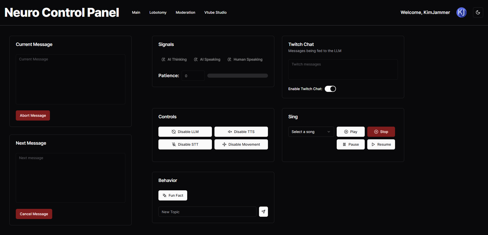
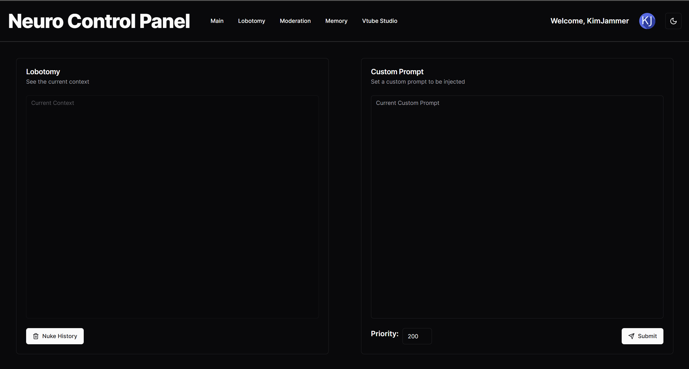
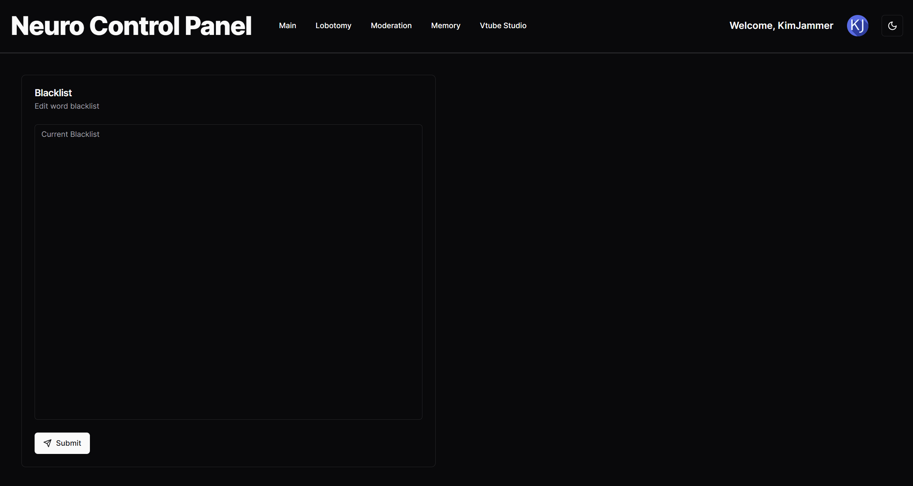
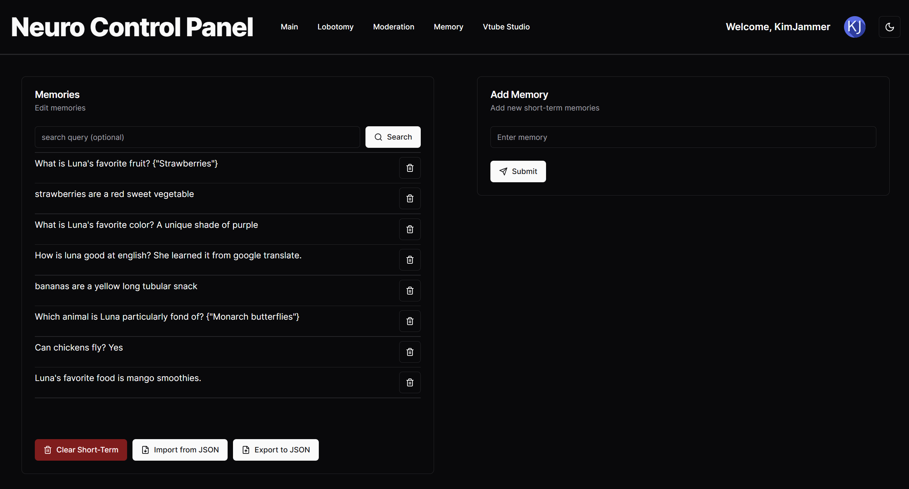
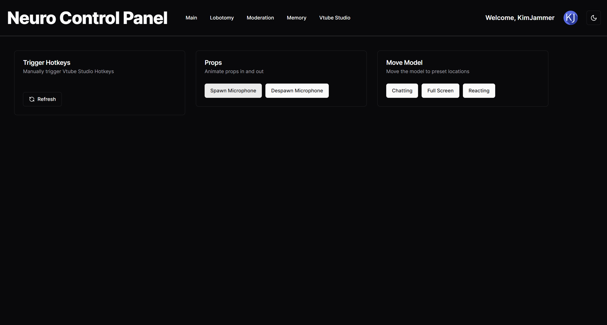

# Neuro Front End



This is a control panel for my Neuro project.

It is written on SvelteKit, and uses the shadcn-svelte components. This project uses socket.io to communicate to the
python backend.

See [Neuro](https://github.com/kimjammer/Neuro)

## Installation

```
npm install
npm run build
npm run preview
```

## Gallery




